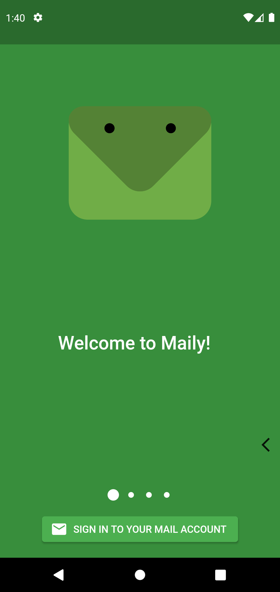
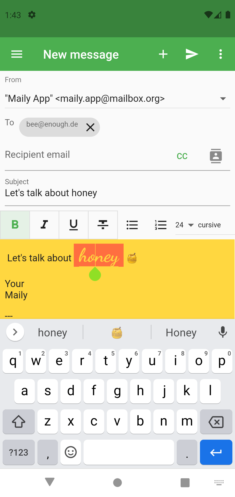
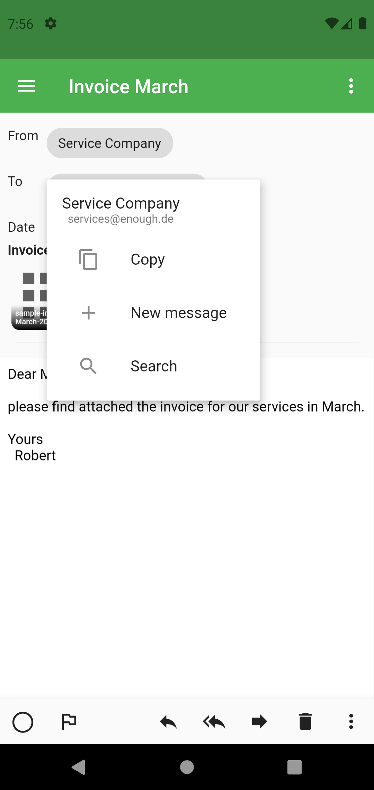
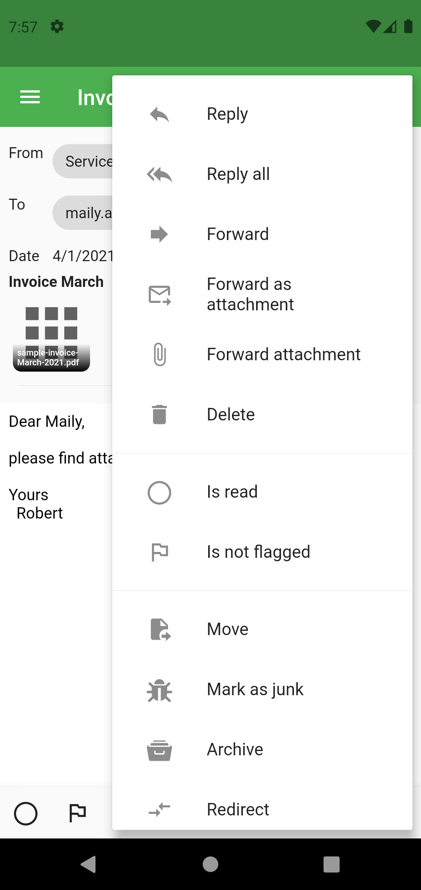
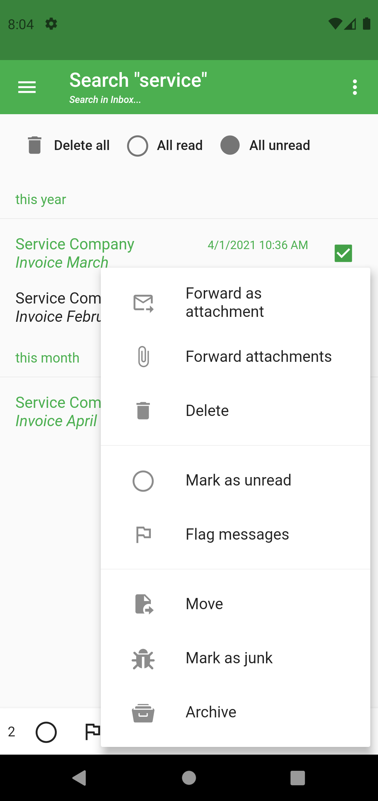
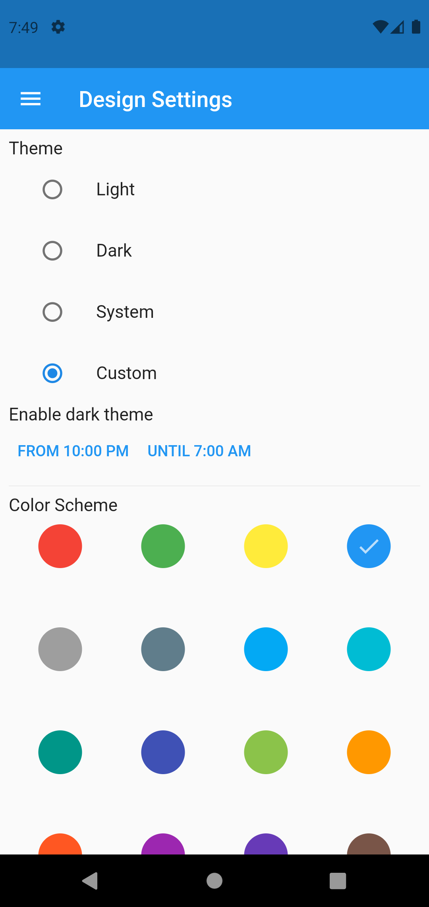

# Codename: Maily
Mail app for iOS, Android and hopefully more platforms in the future. Developed in [Flutter](https://flutter.dev).

## Test Maily
You can test an early access version of Maily today:
* on Android at [Google Play](https://play.google.com/store/apps/details?id=de.enough.enough_mail_app).
* on iOS with [TestFlight](https://testflight.apple.com/join/6TFIg0uJ).

## Screenshots Android

## Features
* POP and IMAP service providers are supported, though  POP accounts are not tested at this moment
* Multiple account support
* Unified account - when you have at least 2 accounts, a unified account will show up automatically - with unified inbox, sent, trash, etc
* Mail management: delete, mark as read/unread
* Unsubscribe from newslettters easily
* View attachments in app - photos, PDFs, video and audio files 
* Compose messages: compose new messages and reply to/forward mails with WYSIWG editor  
* Save and continue draft messages
* Attach photo-, audio-, video- or generic files. Attach your current location.
* Swipe right to left to delete and swipe left to right to mark as read/unread
* Personalizae swipe actions
* Optionally you can block external images when viewing mails
* You can specify aliases and check for + alias support by your mail provider
* Swipe left or right in the message details to view the next/previous message
* Experimental 'stack' display of messages
* Share received attachments to other apps and forward attachments to a new message
* Share files to Maily
* Search for messages, including universal search
* Delete all messages in trash and junk folders or in a search result
* Archive messages
* Mark messages as junk / not junk
* Forward messages as attachments - or forward only the attachments of the selected messages
* Select several messages at once with a long press
* Localized in English and German
* Supports dark and light theme and you can also change the color scheme.
* Shows thread information and allows to access the full thread when the mail service supports the `THREAD` IMAP extension.
* Add animated GIFs and stickers (powered by Giphy)
* Display attached messages
* Request and send read receipts
* Extensible by email service providers, companies and developers

## Miss a feature or found a bug?

Please file feature requests and bugs at the [issue tracker](https://github.com/Enough-Software/enough_mail_app/issues).

## Contributions and Setup
Every contribution is welcome. Since the project is licensed under the [GPL](LICENSE), signing the [Contributor License Agreement](CLA.md) is required.  

This is how you contribute:

* Fork the [enough_mail_app](https://github.com/enough-software/enough_mail_app/) project by pressing the fork button.
* Clone your fork to your computer: `git clone github.com/$your_username/enough_mail_app`
* Do your changes. When you are done, commit changes with `git add -A` and `git commit`.
* Push changes to your personal repository: `git push origin`
* Go to [enough_mail_app](https://github.com/enough-software/enough_mail_app/) and create a pull request.

When you have compile problems this is usually due to not getting the latest version from git. Call `flutter pub upgrade` to ensure that you are on the latest version of all referenced projects. Since translations are generated you can ignore all translation problems, just start the build, afterwards the localization compilation problems will be gone.

For some features you will need to add the relevant keys to *assets/keys.txt*, currently the following key is required:
* giphy: https://developers.giphy.com/ 

## Localizations
When you change translations, re-generate the translations files by calling `flutter gen-l10n`.
Missing translations will be listed in `missing-translations.txt`.

## JSON Generation for Persistence
We use the standard [json_serializable](https://pub.dev/packages/json_serializable) package for generating 
JSON and [hive](https://pub.dev/packages/hive) for storage. 
When changing such classes, you have to re-run code generation
by calling `flutter pub run build_runner build --delete-conflicting-outputs`.

## License
`enough_mail_app` is licensed under the [GNU Public License 3.0 "GPL"](LICENSE). In a nutshell this means that you can play around as much as possible for private reasons, but that you need to publish your changes under the GPL, as soon as you the code commercially.

## Related Projects
Check out these related projects:
* [enough_mail](https://github.com/Enough-Software/enough_mail) mail libraries in pure Dart.
* [enough_mail_html](https://github.com/Enough-Software/enough_mail_html) generates HTML out of a `MimeMessage`.
* [enough_mail_flutter](https://github.com/Enough-Software/enough_mail_flutter) provides some common Flutter widgets for any mail app.
* [enough_media](https://github.com/Enough-Software/enough_media) provides media rendering widgets.  
* [enough_convert](https://github.com/Enough-Software/enough_convert) provides the encodings missing from `dart:convert`.  

